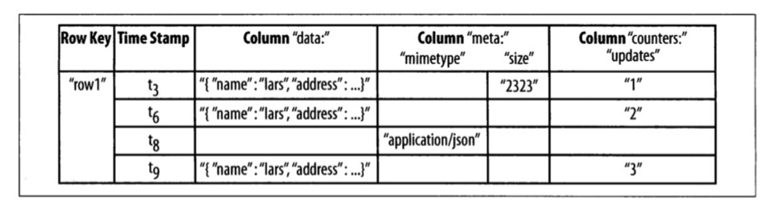

- [HBase](#hbase)
  - [概述](#概述)
    - [需求](#需求)
    - [结构](#结构)
  - [实战](#实战)
    - [hello world](#hello-world)
  - [原理](#原理)
  - [参考文献](#参考文献)

# HBase

## 概述

### 需求

+ 业务需求：海量数据 & 高效检索
+ 关系型数据库的问题 & 解决方案
  + 读写压力：sharding
  + 索引的瓶颈
  + 适合事务操作，但不见长于超大规模的数据分析处理。
+ HBase的优势——案例。

### 结构

+ 行(row)、列(col)、单元格(cell)
+ 行键(RowKey)。所有行按rowKey的字典序存储
+ 每行每列可能有多个版本，存储在不同的Cell中；按时间戳降序排列。
+ 列族(CF)：CF是Schema-Free的

综上，HBase的数据存取模式为：

```
(Table,RowKey,CF,Column,Timestamp) -> Value
```



+ 一致性
  + 行数据的读写操作是原子的，具有强一致性。
  + (跨表、跨行)分布式事务支持？
+ 分区(region & region server)
  + region server和region是一对多的关系
+ 实现(详见原理一节)
  + 存储(HFile)；索引(数据块)；读取时先读取索引到内存，进行二分查找。
  + 写数据：WAL(恢复) & memstore(缓存)
  + 架构
    + 客户端(API)
    + server：master(ZooKeeper)、region servers
    + HDFS

## 实战

### hello world

单机部署运行，安装版本`2.4.7`。

+ 前置：安装Java。(hadoop非必须，可用本地存储代替)
+ 修改 `conf/hbase-env.sh` 中的`JAVA_HOME`环境变量，并启用。
+ 启动 `bin/start-hbase.sh`

此时默认配置会将数据存储在hbase根路径下的`tmp/`，重启后不会删除。

```
<property>
  <name>hbase.tmp.dir</name>
  <value>./tmp</value>
</property>
```

进入客户端 `bin/hbase shell`

## 原理

## 参考文献

+ 《HBase权威指南》