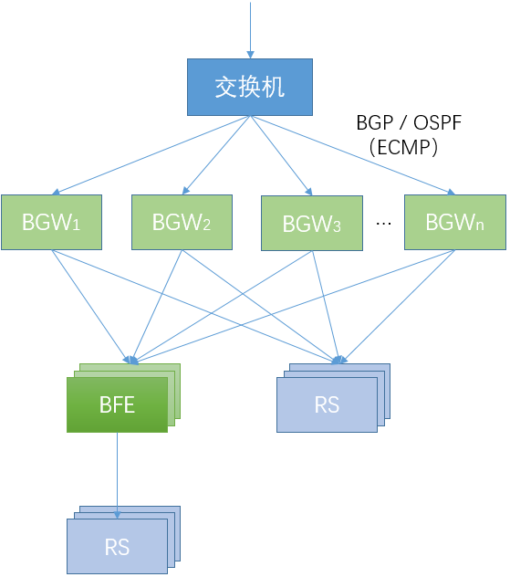
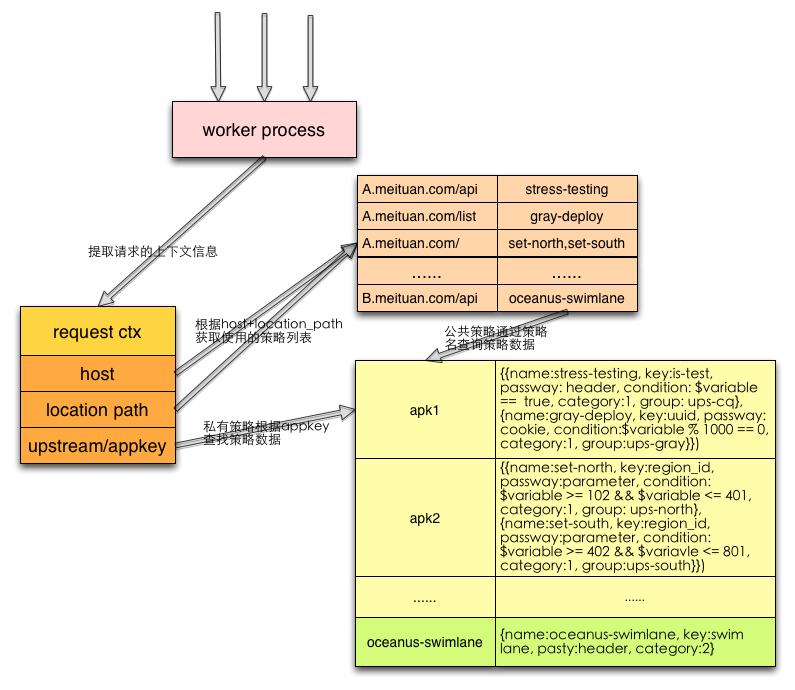

- [API Gateway](#api-gateway)
  - [概述](#概述)
  - [典型案例](#典型案例)
  - [百度BFE](#百度bfe)
    - [概述](#概述-1)
    - [规则](#规则)
    - [插件机制](#插件机制)
    - [限流](#限流)
    - [监控 & 日志](#监控--日志)
    - [配置管理](#配置管理)
  - [美团](#美团)
    - [概述](#概述-2)
  - [Traefik](#traefik)

# API Gateway

## 概述

以下是nginx官网对API Gateway的一段介绍：
[refer](https://www.nginx.com/learn/api-gateway/)

> An API gateway is the conductor that organizes the requests being processed by the microservices architecture to create a simplified experience for the user. 面向微服务。
> It’s a translator, taking a client’s many requests and turning them into just one, to reduce the number of round trips between the client and application. 这个“把多个API聚合成一个API”，具体是怎么实现的？
> An API gateway is set up in front of the microservices and becomes the entry point for every new request being executed by the app. It simplifies both the client implementations and the microservices app. 接入层。

## 典型案例

+ 百度
  + [BFE](https://github.com/bfenetworks/bfe)
  + 百度网盘API Gateway
+ 美团
  + [Oceanus](https://tech.meituan.com/2018/09/06/oceanus-custom-traffic-routing.html)
  + [Shepherd](https://mp.weixin.qq.com/s/iITqdIiHi3XGKq6u6FRVdg)
+ [Traefik](https://github.com/traefik/traefik)
+ [Lura](https://github.com/luraproject/lura) 看起来主要是用来做服务编排的。

## 百度BFE

学习内容：原理；（按模块）设计思想、源码

参考材料：

+ [《深入理解BFE》](https://github.com/baidu/bfe-book)

### 概述

+ 定位：百度内部的七层负载均衡接入层
+ 功能：接入和转发、流量调度、WAF、数据分析
+ 接入层技术发展
  + HTTPS：证书维护、性能
  + 安全：DDoS攻击；防御规则检查；计算资源；0 day场景。
  + 数据：接入层的优势？后端延迟、错误；用户所有的流量数据。
  + 控制系统：自动化、智能化。云原生化。
+ 负载均衡：四层负载均衡(BGW) VS 七层负载均衡(BFE)

百度的负载均衡架构

### 规则

### 插件机制

### 限流

### 监控 & 日志

### 配置管理

## 美团

没看到有开源的，因此仅对官方技术文档做一个整理。

### 概述

美团API网关整体架构

如图，整体架构主要包括2个部分：

+ [Oceanus](https://tech.meituan.com/2018/09/06/oceanus-custom-traffic-routing.html)：相当于美团统一前端，负责将流量转发到业务集群。
+ [Shepherd](https://mp.weixin.qq.com/s/iITqdIiHi3XGKq6u6FRVdg)：对业务线API Gateway需求进行了抽象，以服务(API管理)和SDK的形式输出能力。

以下进行展开介绍。

**Oceanus**

这个材料里面我们只能看到定制化路由这部分，关于安全、登陆等常见功能并未做介绍。

+ 基于*OpenResty*开发实现。
+ 策略查询：`Host+location_path` & `appkey`
+ 策略规则设计：`condition`支持简单的规则引擎。
+ 策略更新：使用worker进程间的共享内存，定时更新。

Oceanus策略查询设计

Oceanus策略规则设计

**Shepherd**

TODO：高可用设计。

+ 服务编排：依托公司内部自研的编排中间件 [海盗](https://mp.weixin.qq.com/s?__biz=MjM5NjQ5MTI5OA==&mid=2651748475&idx=3&sn=23b517c9c5173a6585ddc7bfd23a878a&chksm=bd12a1368a65282071cec8ce73f16f86de546b2e22eae0af46cd8b6b88521b2ed14e32fb32e9&scene=21#wechat_redirect)。

## Traefik