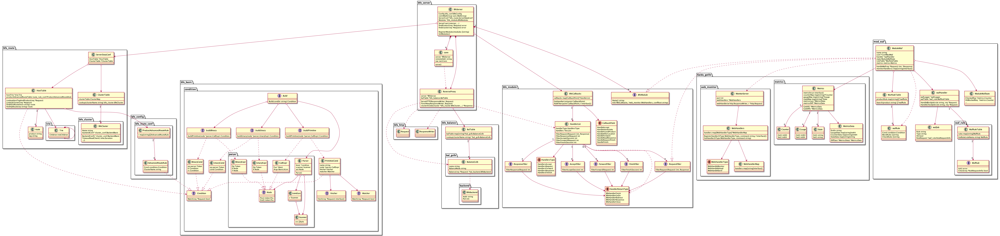

- [API Gateway](#api-gateway)
  - [概述](#概述)
  - [典型案例](#典型案例)
  - [百度BFE](#百度bfe)
    - [概述](#概述-1)
    - [源码结构梳理](#源码结构梳理)
    - [模块插件机制](#模块插件机制)
    - [流量转发](#流量转发)
    - [条件表达式](#条件表达式)
    - [规则](#规则)
    - [插件机制](#插件机制)
    - [限流](#限流)
    - [监控 & 日志](#监控--日志)
    - [配置管理](#配置管理)
  - [美团](#美团)
    - [概述](#概述-2)
  - [Traefik](#traefik)

# API Gateway

## 概述

以下是nginx官网对API Gateway的一段介绍：
[refer](https://www.nginx.com/learn/api-gateway/)

> An API gateway is the conductor that organizes the requests being processed by the microservices architecture to create a simplified experience for the user. 面向微服务。
> It’s a translator, taking a client’s many requests and turning them into just one, to reduce the number of round trips between the client and application. 服务(接口？)编排能力。
> An API gateway is set up in front of the microservices and becomes the entry point for every new request being executed by the app. It simplifies both the client implementations and the microservices app. 接入层。


## 典型案例

+ 百度
  + [BFE](https://github.com/bfenetworks/bfe)
  + 百度网盘API Gateway
+ 美团
  + [Oceanus](https://tech.meituan.com/2018/09/06/oceanus-custom-traffic-routing.html)
  + [Shepherd](https://mp.weixin.qq.com/s/iITqdIiHi3XGKq6u6FRVdg)
+ [Traefik](https://github.com/traefik/traefik)
+ [Lura](https://github.com/luraproject/lura) 看起来主要是用来做服务编排的。

## 百度BFE

学习内容：原理；（按模块）设计思想、源码

参考材料：

+ [《深入理解BFE》](https://github.com/baidu/bfe-book)

### 概述

+ 定位：百度内部的七层负载均衡接入层
+ 功能：接入和转发、流量调度、WAF、数据分析
+ 接入层技术发展
  + HTTPS：证书维护、性能
  + 安全：DDoS攻击；防御规则检查；计算资源；0 day场景。
  + 数据：接入层的优势？后端延迟、错误；用户所有的流量数据。
  + 控制系统：自动化、智能化。云原生化。
+ 负载均衡：四层负载均衡(BGW) VS 七层负载均衡(BFE)

<div align=center>
  
  <div style="font-size:14px">百度的负载均衡架构</div>
</div>

### 源码结构梳理

<div align=center>
  
  <div style="font-size:14px">bfe源码结构</div>
</div>


`BfeServer`顶层对象

+ `BfeServer`对应一个监听协程，每个监听协程针对每个请求开启1个处理协程。单个bfe进程可以配置多个`BfeServer`。
+ `BfeServer`通过`WaitGroup`控制请求处理协程，并实现优雅重启。
+ `Serve()`方法负责执行整个请求处理及响应。其中，`conn`对象负责实现基础网络功能，`ReverseProxy`对象负责实现路由、负载均衡等核心功能。完整流程详见[请求处理流程及响应](https://github.com/baidu/bfe-book/blob/version1/implementation/life_of_a_request/life_of_a_request.md)一节，代码参见`ReverseProxy.ServeHTTP()`。
+ `BfeServer`依赖回调框架能力(`bfe_module`包)，注册并顺序执行回调链，实现请求的定制化处理。

### 模块插件机制

参考章节：[模块框架](https://github.com/baidu/bfe-book/blob/version1/implementation/model_framework/model_framework.md)
代码模块：`bfe_module`

**回调模型**

BFE通过*回调*来执行插件功能。

+ 回调框架(BfeCallbacks)
+ 回调点(CallbackPoint)
+ 回调链(HandlerList)
+ 回调(接口)类型：`RequestFilter`等5个回调接口。

**实现细节**

+ `bfe_module.HandlerList`内表示回调类型的类型成员事实上并没有什么用。回调接口类型是通过`switch type {}`动态判断的。

### 流量转发

**转发模型**

参考章节：[BFE的转发模型](https://github.com/baidu/bfe-book/blob/version1/design/model/model.md)

+ 租户(Tenant/Product)：大致上，一个域名对应一个租户。百度内部可能叫“产品线”。
+ 集群(Cluster)：一个租户可以对应多个集群，一个租户维护一个路由转发表。一个集群一般按照不同的IDC再划分多个子集群。
+ 实例：`ip:port`

**实现机制**

设计为2个核心能力

+ [请求路由](https://github.com/baidu/bfe-book/blob/version1/implementation/routing/routing.md)：负责通过域名、Vip、path等特征，根据路由规则，获取租户->集群。代码上对应`bfe_route`包，规则的解析则依赖`bfe_route_conf`包。
+ [负载均衡](https://github.com/baidu/bfe-book/blob/version1/implementation/balancing/balancing.md)：已知下游集群的情况下，根据负载均衡策略，获取子集群->实例。代码上对应`bfe_balancer`包。

**实现细节**

+ (根据域名)获取租户 `HostTable.findHostRoute`

```go
func (t *HostTable) findHostRoute(host string) (route, error) {
	// ...
	match, ok := t.hostTrie.Get(strings.Split(string_reverse.ReverseFqdnHost(hostnameStrip(host)), "."))
	if ok {
		// get route success, return
		return match.(route), nil
	}
  // ...
}
```

使用了一棵域名[前缀树](https://zhuanlan.zhihu.com/p/28891541)来查找，从根节点到叶子节点为一个完整域名。从根节点往下依次是各级[域名](https://baike.baidu.com/item/%E9%A1%B6%E7%BA%A7%E5%9F%9F%E5%90%8D/2152551)，到了叶子节点则是租户。

查找算法：

```go
func (t *Trie) Get(path []string) (entry interface{}, ok bool) {
	// 递归终止条件
	if len(path) == 0 {
		return t.getEntry()
	}

	// key是当前前缀
	key := path[0]
	// newPath做为递归查找的输入路径
	newPath := path[1:]

	res, ok := t.Children[key]
	if ok {
		// 递归查找
		entry, ok = res.Get(newPath)
	}

	// ...
}
```

+ 获取集群 `HostTable.LookupCluster`

路由规则的检查和动作执行代码如下：

```go
// LookupCluster find clusterName with given request.
func (t *HostTable) LookupCluster(req *bfe_basic.Request) error {
	// match advanced route rules 获取路由规则表
	rules, ok := t.productAdvancedRouteTable[req.Route.Product]
	if !ok {
		req.Route.ClusterName = ""
		req.Route.Error = ErrNoProductRule
		return req.Route.Error
	}

	// matching route rules 规则检查
	for _, rule := range rules {
		// 条件表达式描述的规则
		if rule.Cond.Match(req) {
			clusterName = rule.ClusterName
			break
		}
	}

	// ...
}
```

可见，`productAdvancedRouteTable`中预先(显然是在server初始化阶段)注册了一些列分流条件，在这里根据请求(参数)进行逐个进行判断，直至找到符合条件的集群。
关于分流条件的实现细节，详见[条件表达式](#条件表达式)一节。

### 条件表达式

参考章节：[BFE的路由转发机制—条件表达式](https://github.com/baidu/bfe-book/blob/version1/design/route/route.md)
代码模块：`bfe_basic/condition`

### 规则

规则示例：以下是一个rewrite配置。
```json
{
    "Version": "1",
    "Config": {
        "example_product": [
            {
                "Cond": "req_path_prefix_in(\"/rewrite\", false)",
                "Actions": [
                    {
                        "Cmd": "PATH_PREFIX_ADD",
                        "Params": [
                            "/bfe/"
                        ]
                    }
                ],
                "Last": true
            }
        ]
    }
}
```

> 上述配置为产品线example_product中增加了一个规则：对满足条件"Cond"的请求，执行"Actions"动作（包含动作名"Cmd"和对应的参数），如果"Last"为true，停止执行后续动作，否则继续匹配下一条规则。
> 最终，该规则将修改Path为/rewrite开头的请求，为其增加路径前缀/bfe/，也就是将Path从/rewrite变为/bfe/rewrite。

### 插件机制

### 限流

### 监控 & 日志

### 配置管理

## 美团

没看到有开源的，因此仅对官方技术文档做一个整理。

### 概述

<div align=center>
  
  <div style="font-size:14px">美团API网关整体架构</div>
</div>


如图，整体架构主要包括2个部分：

+ [Oceanus](https://tech.meituan.com/2018/09/06/oceanus-custom-traffic-routing.html)：相当于美团统一前端，负责将流量转发到业务集群。
+ [Shepherd](https://mp.weixin.qq.com/s/iITqdIiHi3XGKq6u6FRVdg)：对业务线API Gateway需求进行了抽象，以服务(API管理)和SDK的形式输出能力。

以下进行展开介绍。

**Oceanus**

这个材料里面我们只能看到定制化路由这部分，关于安全、登陆等常见功能并未做介绍。

+ 基于*OpenResty*开发实现。
+ 策略查询：`Host+location_path` & `appkey`
+ 策略规则设计：`condition`支持简单的规则引擎。
+ 策略更新：使用worker进程间的共享内存，定时更新。

<div align=center>
  
  <div style="font-size:14px">Oceanus策略查询设计</div>
</div>


<div align=center>
  
  <div style="font-size:14px">Oceanus策略规则设计</div>
</div>

**Shepherd**

TODO：高可用设计。

+ 服务编排：依托公司内部自研的编排中间件 [海盗](https://mp.weixin.qq.com/s?__biz=MjM5NjQ5MTI5OA==&mid=2651748475&idx=3&sn=23b517c9c5173a6585ddc7bfd23a878a&chksm=bd12a1368a65282071cec8ce73f16f86de546b2e22eae0af46cd8b6b88521b2ed14e32fb32e9&scene=21#wechat_redirect)。

## Traefik