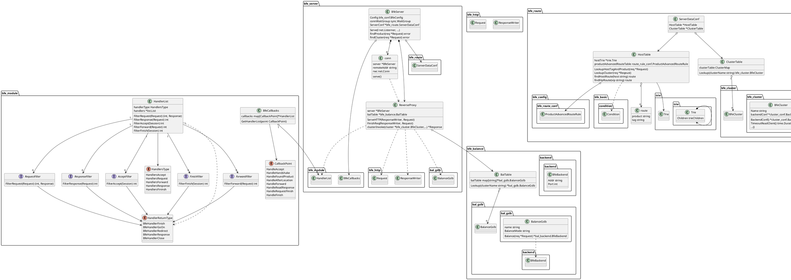

```plantuml
@startuml

package bfe_balance {
    package backend {
        class backend.BfeBackend {
            Addr string
            Port int 
        }
    }

    package bal_gslb {
        class bal_gslb.BalanceGslb {
            name string
            BalanceMode string

            Balance(req *Request) *bal_backend.BfeBackend
        }
        bal_gslb.BalanceGslb ..> backend.BfeBackend
    }

    class bfe_balance.BalTable {
        balTable map[string]*bal_gslb.BalanceGslb

        Lookup(clusterName string) *bal_gslb.BalanceGslb
    }
    bfe_balance.BalTable "1" o--> "n" bal_gslb.BalanceGslb
}


package bfe_server {
    class BfeServer {
        Config bfe_conf.BfeConfig
        connWaitGroup sync.WaitGroup
        ServerConf *bfe_route.ServerDataConf

        Serve(l net.Listerner, ...)
        findProduct(req *Request) error
        findCluster(req *Request) error
    }
    BfeServer "1" *--> "n" conn
    BfeServer *--> ReverseProxy
    BfeServer o--> bfe_module.BfeCallbacks
    BfeServer o--> bfe_route.ServerDataConf

    class conn {
        server *BfeServer
        remoteAddr string
        rwc net.Conn

        serve()
    }
    conn ..> ReverseProxy

    class ReverseProxy {
        server *BfeServer
        balTable *bfe_balance.BalTable

        ServeHTTP(ResponseWriter, Request)
        FinishReq(ResponseWriter, Request)
        clusterInvoke(cluster *bfe_cluster.BfeCluster,...) *Response
    }
    ReverseProxy ..> bfe_http.ResponseWriter
    ReverseProxy ..> bfe_http.Request
    ReverseProxy ..> bfe_module.HandlerList
    ReverseProxy o--> bfe_balance.BalTable
    ReverseProxy ..> bal_gslb.BalanceGslb
}


package bfe_http {
    class ResponseWriter {}
    class Request {}
}


package bfe_module {
    class BfeCallbacks {
        callbacks map[CallbackPoint]*HandlerList

        GetHandlerList(point CallbackPoint)
    }
    BfeCallbacks --> CallbackPoint
    BfeCallbacks "1" o--> "n" HandlerList

    enum CallbackPoint {
        HandleAccept
        HandleHandshake
        HandleFoundProduct
        HandleAfterLocation
        HandleForward
        HandleReadResponse
        HandleRequestFinish
        HandleFinish
    }

    class HandlerList {
        handlerType HandlersType
        handlers *list.List

        FilterRequest(Request) (int, Response)
        FilterResponse(Request) int
        FilterAccept(Session) int
        FilterForward(Request) int
        FilterFinish(Session) int
    }
    HandlerList --> HandlersType
    HandlerList "1" --> "n" RequestFilter
    HandlerList "1" --> "n" ResponseFilter
    HandlerList "1" --> "n" AcceptFilter
    HandlerList "1" --> "n" ForwardFilter
    HandlerList "1" --> "n" FinishFilter
    HandlerList ..> HandlerReturnType

    enum HandlersType {
        HandlersAccept
        HandlersRequest
        HandlersForward
        HandlersResponse
        HandlersFininsh
    }

    interface RequestFilter {
        FilterRequest(Request) (int, Response)
    }
    RequestFilter --> HandlerReturnType
    interface ResponseFilter {
        FilterResponse(Request) int
    }
    ResponseFilter --> HandlerReturnType
    interface AcceptFilter {
        FilterAccept(Session) int
    }
    AcceptFilter --> HandlerReturnType
    interface ForwardFilter {
        FilterForward(Request) int
    }
    ForwardFilter --> HandlerReturnType
    interface FinishFilter {
        FilterFinish(Session) int
    }
    FinishFilter --> HandlerReturnType

    enum HandlerReturnType {
        BfeHandlerFinish
        BfeHandlerGoOn
        BfeHandlerRedirect
        BfeHandlerResponse
        BfeHandlerClose
    }
}


package bfe_route {
    class ServerDataConf {
        HostTable *HostTable
        ClusterTable *ClusterTable
    }
    ServerDataConf o--> HostTable
    ServerDataConf o--> ClusterTable

    package trie {
        class trie.Trie {
            Children trieChildren
        }
        trie.Trie *--> trie.Trie
    }

    class route {
        product string
        tag string
    }

    class HostTable {
        hostTrie *trie.Trie
        productAdvancedRouteTable route_rule_conf.ProductAdvancedRouteRule

        LookupHostTagAndProduct(req *Request)
        LookupCluster(req *Reqeust)
        findHostRoute(host string) route
        findVipRoute(vip string) route
    }
    HostTable --> trie.Trie
    HostTable "1" o--> "n" route
    HostTable o--> bfe_config.bfe_route_conf.ProductAdvancedRouteRule
    HostTable ..> bfe_basic.condition.Condition

    package bfe_cluster {
        class bfe_cluster.BfeCluster {
            Name string
            backendConf *cluster_conf.BackendBasic

            BackendConf() *cluster_conf.BackendBasic
            TimeoutReadClient() time.Duration
            ...()
        }
    }

    class ClusterTable {
        clusterTable ClusterMap

        Lookup(clusterName string) bfe_cluster.BfeCluster
    }
    ClusterTable "1" o--> "n" bfe_cluster.BfeCluster
}


package bfe_config.bfe_route_conf {
    class ProductAdvancedRouteRule {
        r map[string][]AdvancedRouteRule
    }
    ProductAdvancedRouteRule "1" o--> "n" AdvancedRouteRule

    class AdvancedRouteRule {
        Cond condition.Condition
    }
    AdvancedRouteRule ..|> bfe_basic.condition.Condition
}


package bfe_basic.condition {
    interface Condition {
        Match(req *Request) bool
    }
}


@enduml
```