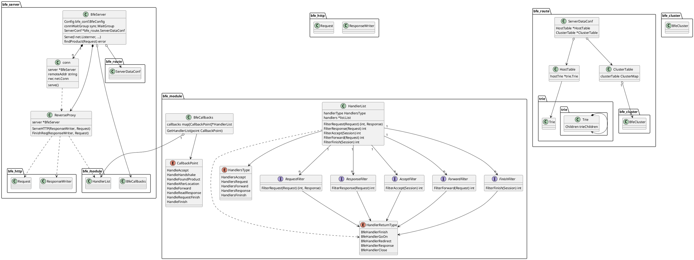

```plantuml
@startuml


package bfe_server {
    class BfeServer {
        Config bfe_conf.BfeConfig
        connWaitGroup sync.WaitGroup
        ServerConf *bfe_route.ServerDataConf

        Serve(l net.Listerner, ...)
        findProduct(Request) error
    }
    BfeServer "1" *--> "n" conn
    BfeServer *--> ReverseProxy
    BfeServer o--> bfe_module.BfeCallbacks
    BfeServer o--> bfe_route.ServerDataConf

    class conn {
        server *BfeServer
        remoteAddr string
        rwc net.Conn

        serve()
    }
    conn ..> ReverseProxy

    class ReverseProxy {
        server *BfeServer

        ServeHTTP(ResponseWriter, Request)
        FinishReq(ResponseWriter, Request)
    }
    ReverseProxy ..> bfe_http.ResponseWriter
    ReverseProxy ..> bfe_http.Request
    ReverseProxy ..> bfe_module.HandlerList
}


package bfe_http {
    class ResponseWriter {}
    class Request {}
}


package bfe_module {
    class BfeCallbacks {
        callbacks map[CallbackPoint]*HandlerList

        GetHandlerList(point CallbackPoint)
    }
    BfeCallbacks --> CallbackPoint
    BfeCallbacks "1" o--> "n" HandlerList

    enum CallbackPoint {
        HandleAccept
        HandleHandshake
        HandleFoundProduct
        HandleAfterLocation
        HandleForward
        HandleReadResponse
        HandleRequestFinish
        HandleFinish
    }

    class HandlerList {
        handlerType HandlersType
        handlers *list.List

        FilterRequest(Request) (int, Response)
        FilterResponse(Request) int
        FilterAccept(Session) int
        FilterForward(Request) int
        FilterFinish(Session) int
    }
    HandlerList --> HandlersType
    HandlerList "1" --> "n" RequestFilter
    HandlerList "1" --> "n" ResponseFilter
    HandlerList "1" --> "n" AcceptFilter
    HandlerList "1" --> "n" ForwardFilter
    HandlerList "1" --> "n" FinishFilter
    HandlerList ..> HandlerReturnType

    enum HandlersType {
        HandlersAccept
        HandlersRequest
        HandlersForward
        HandlersResponse
        HandlersFininsh
    }

    interface RequestFilter {
        FilterRequest(Request) (int, Response)
    }
    RequestFilter --> HandlerReturnType
    interface ResponseFilter {
        FilterResponse(Request) int
    }
    ResponseFilter --> HandlerReturnType
    interface AcceptFilter {
        FilterAccept(Session) int
    }
    AcceptFilter --> HandlerReturnType
    interface ForwardFilter {
        FilterForward(Request) int
    }
    ForwardFilter --> HandlerReturnType
    interface FinishFilter {
        FilterFinish(Session) int
    }
    FinishFilter --> HandlerReturnType

    enum HandlerReturnType {
        BfeHandlerFinish
        BfeHandlerGoOn
        BfeHandlerRedirect
        BfeHandlerResponse
        BfeHandlerClose
    }
}


package bfe_route {
    class ServerDataConf {
        HostTable *HostTable
        ClusterTable *ClusterTable
    }
    ServerDataConf o--> HostTable
    ServerDataConf o--> ClusterTable

    package trie {
        class trie.Trie {
            Children trieChildren
        }
        trie.Trie *--> trie.Trie
    }

    class HostTable {
        hostTrie *trie.Trie
    }
    HostTable --> trie.Trie

    class ClusterTable {
        clusterTable ClusterMap
    }
    ClusterTable "1" o--> "n" bfe_cluster.BfeCluster
}


package bfe_cluster {
    class BfeCluster {}
}


@enduml
```