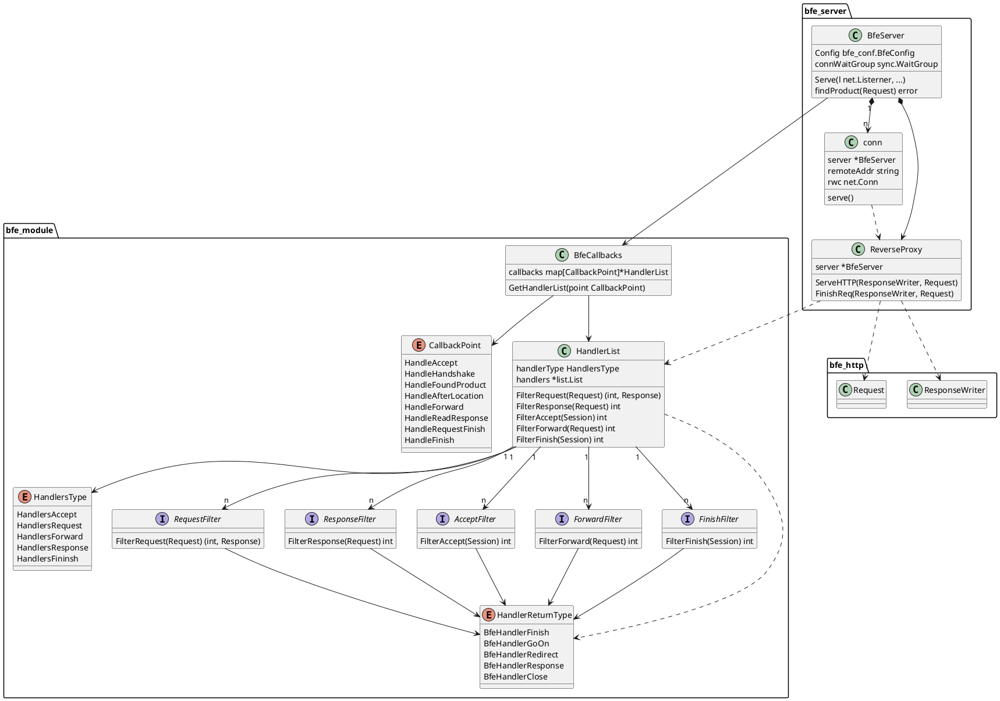

```plantuml
@startuml

class bfe_server.BfeServer {
    Config bfe_conf.BfeConfig
    connWaitGroup sync.WaitGroup

    Serve(l net.Listerner, ...)
    findProduct(Request) error
}
bfe_server.BfeServer "1" *--> "n" bfe_server.conn
bfe_server.BfeServer *--> bfe_server.ReverseProxy
bfe_server.BfeServer --> bfe_module.BfeCallbacks

class bfe_server.conn {
    server *BfeServer
    remoteAddr string
    rwc net.Conn

    serve()
}
bfe_server.conn ..> bfe_server.ReverseProxy

class bfe_server.ReverseProxy {
    server *BfeServer

    ServeHTTP(ResponseWriter, Request)
    FinishReq(ResponseWriter, Request)
}
bfe_server.ReverseProxy ..> bfe_http.ResponseWriter
bfe_server.ReverseProxy ..> bfe_http.Request
bfe_server.ReverseProxy ..> bfe_module.HandlerList


class bfe_http.ResponseWriter {}
class bfe_http.Request {}


class bfe_module.BfeCallbacks {
    callbacks map[CallbackPoint]*HandlerList

    GetHandlerList(point CallbackPoint)
}
bfe_module.BfeCallbacks --> bfe_module.CallbackPoint
bfe_module.BfeCallbacks --> bfe_module.HandlerList

enum bfe_module.CallbackPoint {
    HandleAccept
    HandleHandshake
    HandleFoundProduct
    HandleAfterLocation
    HandleForward
    HandleReadResponse
    HandleRequestFinish
    HandleFinish
}

class bfe_module.HandlerList {
    handlerType HandlersType
    handlers *list.List

    FilterRequest(Request) (int, Response)
    FilterResponse(Request) int
    FilterAccept(Session) int
    FilterForward(Request) int
    FilterFinish(Session) int
}
bfe_module.HandlerList --> bfe_module.HandlersType
bfe_module.HandlerList "1" --> "n" bfe_module.RequestFilter
bfe_module.HandlerList "1" --> "n" bfe_module.ResponseFilter
bfe_module.HandlerList "1" --> "n" bfe_module.AcceptFilter
bfe_module.HandlerList "1" --> "n" bfe_module.ForwardFilter
bfe_module.HandlerList "1" --> "n" bfe_module.FinishFilter
bfe_module.HandlerList ..> bfe_module.HandlerReturnType

enum bfe_module.HandlersType {
    HandlersAccept
    HandlersRequest
    HandlersForward
    HandlersResponse
    HandlersFininsh
}

interface bfe_module.RequestFilter {
    FilterRequest(Request) (int, Response)
}
bfe_module.RequestFilter --> bfe_module.HandlerReturnType
interface bfe_module.ResponseFilter {
    FilterResponse(Request) int
}
bfe_module.ResponseFilter --> bfe_module.HandlerReturnType
interface bfe_module.AcceptFilter {
    FilterAccept(Session) int
}
bfe_module.AcceptFilter --> bfe_module.HandlerReturnType
interface bfe_module.ForwardFilter {
    FilterForward(Request) int
}
bfe_module.ForwardFilter --> bfe_module.HandlerReturnType
interface bfe_module.FinishFilter {
    FilterFinish(Session) int
}
bfe_module.FinishFilter --> bfe_module.HandlerReturnType

enum bfe_module.HandlerReturnType {
    BfeHandlerFinish
    BfeHandlerGoOn
    BfeHandlerRedirect
    BfeHandlerResponse
    BfeHandlerClose
}

@enduml
```