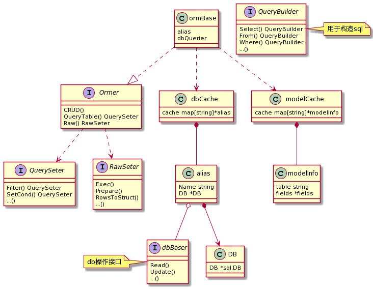
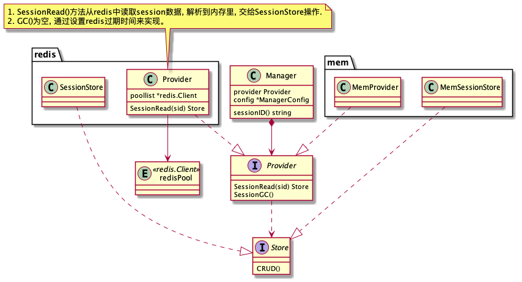

- [beego](#beego)
  - [hello world](#hello-world)
  - [架构/源码](#架构源码)
    - [Controller](#controller)
    - [Model](#model)
    - [session模块](#session模块)
    - [cache模块](#cache模块)

# beego

我们来学习**beego**框架。[源码注释](https://github.com/tjufc/beego/tree/note_master)
[文档](https://beego.vip/docs/intro/)

## hello world

+ 使用`bee`工具创建web项目/api项目
+ `web.Run` web包封装了conf/路由/ListenAndServe等逻辑

## 架构/源码

### Controller

应用涉及的主要接口大多在`web`包里

+ `main`入口函数, go执行流程(可以想象成用栈来模拟实现) TODO补充图
+ **AOP**: [介绍](https://www.zhihu.com/question/24863332)
+ *config* 模块
    + *core*包：`Configer`接口规定了配置读取的方法；`Config`接口规定了和原始数据的操作，封装了不同格式的适配器(ini/xml/yaml...)
    + *server/web*包：实现`Configer`接口
    + 不同RunMode支持 (参考*ini.go*文件)
        + 写(配置)：*config* 模块支持多section
        + 读(配置)：读的时候需要调用者按照协议指定  `SectionName::ParamName`
    + 支持include (见*ini.go*)
    + conf模块可以利用包级别的 `init()`方法实现(每次加载包执行一次，golang对每个包都只加载一次)。

+ 路由
    + `web.Router` 正则路由/固定路由, 支持定义func。`METHOD`是http协议标准中的几个
    + `web.AutoRouter` 这个比较灵活
    + `namespace` 支持嵌套 这样的好处是路由的组织结构比较清晰

+ `Controller`控制器
    + 上下文`ctx.Context` 和 返回值`Data` 字段

+ `Controller.Init`接口。

>web.Controller 实现了接口 web.ControllerInterface，web.ControllerInterface 定义了如下函数：
> + Init(ctx *context.Context, controllerName, actionName string, app interface{})
> + 这个函数主要初始化了 Context、相应的 Controller 名称，模板名，初始化模板参数的容器 Data，app 即为当前执行的 Controller 的 reflecttype，这个 app 可以用来执行子类的方法。

`app`是用于引用子类对象的, 这在go继承中比较常见。看以下代码：

``` go
type NestPreparer interface {
        NestPrepare()
}

// baseRouter implemented global settings for all other routers.
type baseController struct {
        web.Controller
        i18n.Locale
        user    models.User
        isLogin bool
}
// Prepare implemented Prepare method for baseRouter.
func (this *baseController) Prepare() {

        // page start time
        this.Data["PageStartTime"] = time.Now()

        // Setting properties.
        this.Data["AppDescription"] = utils.AppDescription
        this.Data["AppKeywords"] = utils.AppKeywords
        this.Data["AppName"] = utils.AppName
        this.Data["AppVer"] = utils.AppVer
        this.Data["AppUrl"] = utils.AppUrl
        this.Data["AppLogo"] = utils.AppLogo
        this.Data["AvatarURL"] = utils.AvatarURL
        this.Data["IsProMode"] = utils.IsProMode

        if app, ok := this.AppController.(NestPreparer); ok {
                app.NestPrepare()
        }
}
```

这段代码是通过将`baseController`和`NestPreparer`的组合, 实现了`NestPreparer`这段逻辑的注入。还有一种可以想到的实现是, 把`NestPreparer`写成`baseController`级别的接口, 所有子类overwrite这个接口。

注意两种实现方式的区别。

+ `Context`上下文
    + 贯穿一个http请求的完整流程(包括请求&响应的所有信息)
    + `BeegoInput`/`BeegoOutput` 给`http.Request`/`http.Response`增加了一些utils

``` go
// Context Http request context struct including BeegoInput, BeegoOutput, http.Request and http.ResponseWriter.
// BeegoInput and BeegoOutput provides an api to operate request and response more easily.
type Context struct {
	Input          *BeegoInput
	Output         *BeegoOutput
	Request        *http.Request
	ResponseWriter *Response
	_xsrfToken     string
}
```

+ 过滤器
    + `web.InsertFilter` 支持请求阶段参数, 有点类似于nginx的各个阶段
    + `web.InsertFilterChain`

这个设计模式可以借鉴。以下是个`httplib`包的示例，但原理一样。自己实现的`Filter`要传入下一个`Filter`参数(`next`)，并显示调用。

``` go
func myFilter(next httplib.Filter) httplib.Filter {
    return func(ctx context.Context, req *httplib.BeegoHTTPRequest) (*http.Response, error) {
        r := req.GetRequest()
        logs.Info("hello, here is the filter: ", r.URL)
        // Never forget invoke this. Or the request will not be sent
        return next(ctx, req)
    }
}
```

+ 参数校验 `import "github.com/beego/beego/v2/core/validation"` 一个utils, 可以解决平时比较烦的参数校验问题。可以定制错误信息

+ 错误处理 `error.go`
    + 错误码映射 - code/handler 注册
    + `Controller`中统一处理 `c.Abort`, 这里面panic了。那么panic是怎么处理的？TODO

+ jsonp
    + 解决跨域访问资源问题, 回传一个用js函数包裹的json格式返回值(js可以自动解析js), 返回时前端自动调用。 
    + [介绍](https://www.cnblogs.com/dowinning/archive/2012/04/19/json-jsonp-jquery.html) [示例](https://www.runoob.com/json/json-jsonp.html)
    + 从nginx日志上看, 它的http_referer就不是本域的。

beego的代码

``` go
# ...
callback := output.Context.Input.Query("callback")
if callback == "" {
	return errors.New(`"callback" parameter required`)
}
callback = template.JSEscapeString(callback)
callbackContent := bytes.NewBufferString(" if(window." + callback + ")" + callback)
callbackContent.WriteString("(")
callbackContent.Write(content)
callbackContent.WriteString(");\r\n")
return output.Body(callbackContent.Bytes())
```

+ CRSF攻击
  + [原理&防御](https://tech.meituan.com/2018/10/11/fe-security-csrf.html)
  + 第三方网站利用浏览器保存Cookie的特点, 冒充用户操作。由于这种攻击无法获取用户Cookie, 因此防御的基本原理是在网站的代码中加入一些动态参数(Cookie/FormData), 根据此参数鉴权。
  + beego提供的机制: 服务器种一个随机的Cookie。不过代码的实现令人迷惑, 既没有校验过期时间, 也没有存储这个token, 看起来并没有起到防御作用。

``` go
// XSRFToken creates and returns an xsrf token string
func (ctx *Context) XSRFToken(key string, expire int64) string {
	if ctx._xsrfToken == "" {
		token, ok := ctx.GetSecureCookie(key, "_xsrf")
		if !ok {
			token = string(utils.RandomCreateBytes(32))
			// TODO make it configurable
			ctx.SetSecureCookie(key, "_xsrf", token, expire, "", "")
		}
		ctx._xsrfToken = token
	}
	return ctx._xsrfToken
}
```

+ MVC 结合beego源码理解MVC层次划分。一个纯api服务应该怎样分层？

### Model

包地址 `import "github.com/beego/beego/v2/client/orm"`

orm部分的类图(主要类型)，梳理一下主要结构。



+ `ormBase`是实际的orm对象，主要提供了基本的CRUD接口，及满足不同需求的`QuerySeter`和`RawSeter`(至于具体是什么功能，官方文档有详细说明)
+ `dbCache`和`modelCache`分别是管理DB和model的对象。`alias`是对DB的抽象，可以支持不同引擎。
+ `QueryBuilder`提供了用结构化语言构造sql的工具api。

Orm和DB是如何组合起来的？我们先通过demo梳理一下

> 预备知识: 反射。经典特性不做介绍了, 可以看看json/fmt.Sprintf的源码, 有助于理解。

``` go
func init() {
    // set default database
    orm.RegisterDataBase("default", "mysql", "username:password@tcp(127.0.0.1:3306)/db_name?charset=utf8&loc=Local")
    // 这里生成了1个dbAlias对象

    // register model
    orm.RegisterModel(new(User))
    // 内部通过反射解析出modelInfo, 这里包括很多结构化的信息, 例如: 数据库的列名
    // 将User对象对应的modelInfo存入modelCache全局表中

    // create table
    orm.RunSyncdb("default", false, true)
}
```

TODO

+ 我们以`Ormer`的`Read`接口为例深入研究。
+ 事务

### session模块

类图。主要是`Provider`和`Store`两个接口，`session`实例实现包括基于`memory/redis/mysql...`



`GC`机制：基于数据库的实现比较简单，例如`redis`直接通过过期时间托管。
我们主要来看下`memory`实例的实现。这是一个`lru cache`。

``` go
// MemProvider Implement the provider interface
type MemProvider struct {
	lock        sync.RWMutex             // locker
	sessions    map[string]*list.Element // map in memory
	list        *list.List               // for gc
	maxlifetime int64
	savePath    string
}
```

golang官方的`list`包定义了`List`双向链表，不过它不是并发安全的，需要配合锁使用，这里使用了一把读写锁。
`SessionGC`从尾部开始遍历链表，读取每个元素的过期时间先上读锁；淘汰操作时释放读锁，上写锁。
``` go
// SessionGC clean expired session stores in memory session
func (pder *MemProvider) SessionGC(context.Context) {
	pder.lock.RLock()
	for {
		element := pder.list.Back()
		if element == nil {
			break
		}
		if (element.Value.(*MemSessionStore).timeAccessed.Unix() + pder.maxlifetime) < time.Now().Unix() {
			pder.lock.RUnlock()
			pder.lock.Lock()
			pder.list.Remove(element)
			delete(pder.sessions, element.Value.(*MemSessionStore).sid)
			pder.lock.Unlock()
			pder.lock.RLock()
		} else {
			break
		}
	}
	pder.lock.RUnlock()
}
```

### cache模块

基于`memmory`的cache实现比较简单。GC并没有使用`lru/fifo`等策略，而是简单地遍历所有key，把所有过期的key捞出来并删除。

``` go
// MemoryCache is a memory cache adapter.
// Contains a RW locker for safe map storage.
type MemoryCache struct {
	sync.RWMutex
	dur   time.Duration
	items map[string]*MemoryItem
	Every int // run an expiration check Every clock time
}

// GC函数: go bc.vacuum()
// check expiration.
func (bc *MemoryCache) vacuum() {
	// 省略...
	for {
		<-time.After(bc.dur)
		bc.RLock()
		if bc.items == nil {
			bc.RUnlock()
			return
		}
		bc.RUnlock()
        // 捞出所有过期的key
		if keys := bc.expiredKeys(); len(keys) != 0 {
			bc.clearItems(keys)
		}
	}
}
```

接口定义也比较简单，就不多写了。可以自己尝试写一下，官方demo中还有可以优化的地方，例如：加分片提高并发。