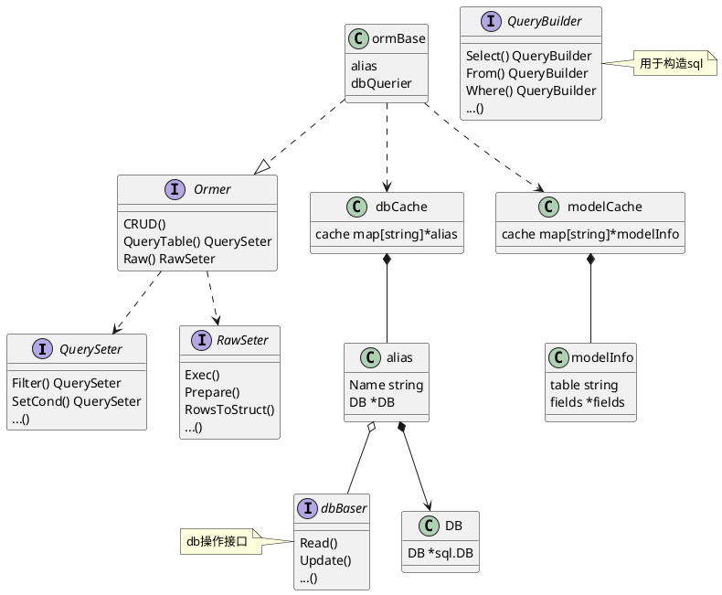

```plantuml
@startuml

interface QuerySeter {
    Filter() QuerySeter
    SetCond() QuerySeter
    ...()
}
interface RawSeter {
    Exec()
    Prepare()
    RowsToStruct()
    ...()
}
interface Ormer {
    CRUD()
    QueryTable() QuerySeter
    Raw() RawSeter
}
Ormer ..> QuerySeter
Ormer ..> RawSeter


class DB {
    DB *sql.DB
}
interface dbBaser {
    Read()
    Update()
    ...()
}
note left: db操作接口
class alias {
    Name string
    DB *DB
}
alias *--> DB
alias o-- dbBaser
class dbCache {
    cache map[string]*alias
}
dbCache *-- alias


class modelInfo {
    table string
    fields *fields
}
class modelCache {
    cache map[string]*modelInfo
}
modelCache *-- modelInfo


class ormBase {
    alias
    dbQuerier
}
ormBase ..|> Ormer
ormBase ..> dbCache
ormBase ..> modelCache


interface QueryBuilder {
    Select() QueryBuilder
    From() QueryBuilder
    Where() QueryBuilder
    ...()
}
note right: 用于构造sql

@enduml
```