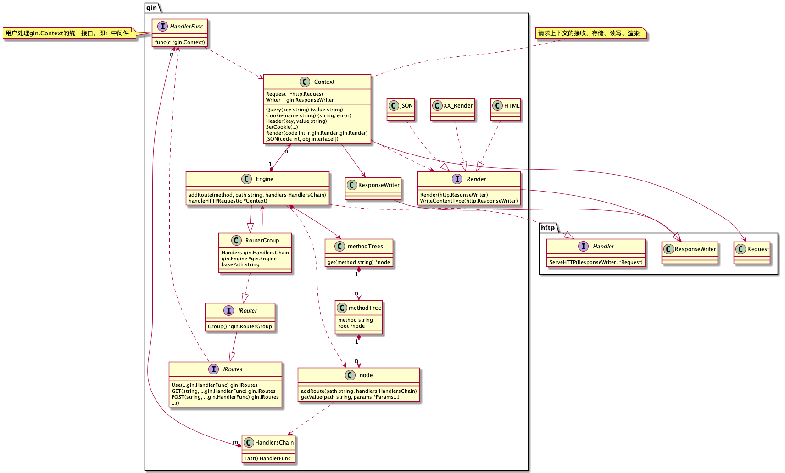

- [gin](#gin)
  - [参考](#参考)
  - [概述](#概述)
  - [实践](#实践)
  - [源码](#源码)

# gin

## 参考

+ [github—gin](https://github.com/gin-gonic/gin)
  + [中文](https://www.kancloud.cn/shuangdeyu/gin_book/949411)
+ [github—middleware](https://github.com/gin-contrib)
+ [gin-gonic官网](https://gin-gonic.com/)

## 概述

轻量级web框架。特点：

+ 性能优势体现在routing和writing上(这两部分是独立实现的，requesting使用了http.Request？)

+ `Bind`机制。将request body绑定到一个结构体。

## 实践

+ 优雅重启

## 源码

我们看到源码的结构非常简单，基本功能全在gin包内。

  
  
gin源码结构

+ `Engine`对象：框架的统一入口，提供路由注册、组装中间件、运行服务等UI。
+ `Context`对象：负责单个请求上下文完整生命周期的管理，包括接收、存储、读写和渲染。它和`Engine`是多对一的聚合关系。
+ `Render`接口：负责定义`Context`渲染接口。gin提供了`JSON`、`HTML`等实现。
+ `methodTree`对象：负责实现路由管理的核心功能。TODO源码学习
+ `RouterGroup`对象 && `IRoutes`接口：负责定义和实现`Engine`路由注册部分的UI。它关联了`Engine`对象，即使用了`methodTrees`提供的机制。
+ `HandleFunc`接口：用户实现请求处理逻辑的统一UI，即 gin*中间件(middleware)*。它在框架内被聚合成`HandlersChain`(数组)，绑定到路由上。

核心机制：

+ 路由：[一篇不错的介绍](https://www.liwenzhou.com/posts/Go/read_gin_sourcecode/)