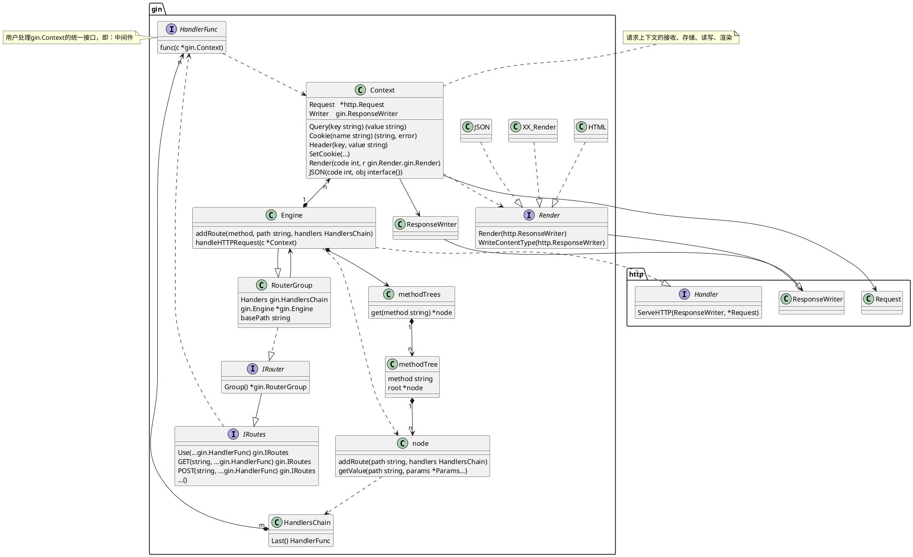

```plantuml
@startuml

class gin.ResponseWriter {}
gin.ResponseWriter --|> http.ResponseWriter

interface gin.Render {
    Render(http.ResonseWriter)
    WriteContentType(http.ResponseWriter)
}
gin.Render --> http.ResponseWriter
class gin.JSON {}
class gin.HTML {}
class gin.XX_Render {}
gin.JSON ..|> gin.Render
gin.HTML ..|> gin.Render
gin.XX_Render ..|> gin.Render

class gin.Context {
    Request   *http.Request
	Writer    gin.ResponseWriter

    Query(key string) (value string)
    Cookie(name string) (string, error)
    Header(key, value string)
    SetCookie(...)
    Render(code int, r gin.Render.gin.Render)
    JSON(code int, obj interface{})
}
note top: 请求上下文的接收、存储、读写、渲染
gin.Context --> gin.ResponseWriter
gin.Context --> http.Request
gin.Context ..> gin.Render
gin.Context "n" <--* "1" gin.Engine


interface gin.HandlerFunc {
    func(c *gin.Context)
}
note left: 用户处理gin.Context的统一接口，即：中间件
gin.HandlerFunc ..> gin.Context

class gin.HandlersChain {
    Last() HandlerFunc
}
gin.HandlersChain "m" *--> "n" gin.HandlerFunc


interface gin.IRoutes {
    Use(...gin.HandlerFunc) gin.IRoutes
    GET(string, ...gin.HandlerFunc) gin.IRoutes
    POST(string, ...gin.HandlerFunc) gin.IRoutes
    ...()
}
gin.IRoutes ..> gin.HandlerFunc

interface gin.IRouter {
    Group() *gin.RouterGroup
}
gin.IRouter --|> gin.IRoutes

class gin.RouterGroup {
    Handers gin.HandlersChain
    gin.Engine *gin.Engine
    basePath string
}
gin.RouterGroup ..|> gin.IRouter
gin.RouterGroup --> gin.Engine


interface http.Handler {
    ServeHTTP(ResponseWriter, *Request)
}

class gin.Engine {
    addRoute(method, path string, handlers HandlersChain)
    handleHTTPRequest(c *Context)
}
gin.Engine --|> gin.RouterGroup
gin.Engine ..|> http.Handler
gin.Engine *--> gin.methodTrees
gin.Engine ..> gin.node


class gin.node {
    addRoute(path string, handlers HandlersChain)
    getValue(path string, params *Params...)
}
gin.node ..> gin.HandlersChain

class gin.methodTree {
    method string
    root *node
}
gin.methodTree "1" *--> "n" gin.node

class gin.methodTrees {
    get(method string) *node
}
gin.methodTrees "1" *--> "n" gin.methodTree


@enduml
```